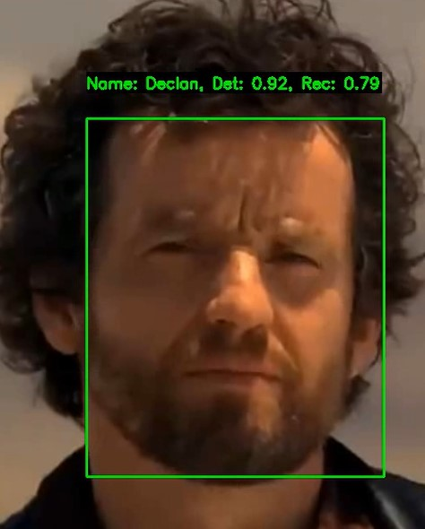

# Face Detection and Recognition Models (PyTorch)

##### Premise: This file was created in tandem with AI so some information may be slightly inaccurate.

This project implements two deep learning models using PyTorch and torchvision:

- **DetectionModel**: A real-time face detection model based on EfficientNet-B0 backbone.
- **RecognitionModel**: A face recognition model using ArcFace head for identity classification or embedding generation.
- 

---

## 📦 Features

### 🧠 DetectionModel - Architecture based on Yolo Object Detection
- Real-time face detection using webcam.
- Bounding box prediction with confidence scores.
- Decoding and visualization of detections.
- Weight loading and saving utilities.
- Live webcam testing with inference timing overlay.

### 🧠 RecognitionModel
- Embedding generation for faces using EfficientNet-B0.
- ArcFace loss head for training with identity labels.
- Supports face similarity comparison.
- Partial weight loading and embedding normalization.
- Image transformation support for standardized input.

---

## 🛠 Requirements

- Python 3.7+
- PyTorch
- torchvision
- OpenCV
- matplotlib
- PIL (Pillow)
- NumPy

Install dependencies:
```bash
pip install torch torchvision opencv-python matplotlib pillow numpy

```

----------

## 🏗 Model Overview

### DetectionModel

-   **Backbone**: EfficientNet-B0
    
-   **Neck**: Custom convolutional layers for feature refinement
    
-   **Heads**:
    
    -   `bbox_head`: Regresses bounding boxes
        
    -   `obj_head`: Predicts objectness confidence
        
-   **Image Input Size**: 256x256
    

### RecognitionModel

-   **Backbone**: EfficientNet-B0
    
-   **ArcFace Layer**: For classification (optional during inference)
    
-   **Embedding Output**: L2-normalized vector (default dim = 384)
    
-   **Image Input Size**: 256x256
    

----------

## 🚀 Usage

### 🧪 Face Detection

```python
from models import DetectionModel

model = DetectionModel(weights="path/to/detector_weights.pt")
model.live_test(conf_thresh=0.85)

```

### 📸 Face Detection on Image

```python
from PIL import Image
img = Image.open("path/to/image.jpg")
model.face_and_plot(img)

```

### 🔍 Face Recognition

```python
from models import RecognitionModel

rec = RecognitionModel(weights="path/to/recognition_weights.pth")
similarity = rec.compare_faces(img1, img2)
print(f"Cosine Similarity: {similarity:.4f}")

```

----------

## 🧪 Example: Embedding Generation

```python
embedding = rec.generate_emb(img)

```

## 🧪 Example: Training with ArcFace (requires labels)

```python
logits = rec(input_tensor, labels)

```

----------

## 📂 File Structure

```text
models.py               # Core models and utilities
tools.py 				# Basic Tools 
README.md               # You're here
weights/ 				# coming soon
```

----------

## 💾 Saving & Loading Weights

### DetectionModel

```python
model.save_weights("detector.pth")
model.load_weights("detector.pth")

```

### RecognitionModel

```python
model.save_weights("recognition.pth")
model.load_weights_partial("recognition.pth")
# They are also nn.Module's so you can use model.load_state_dict() 
# or torch.save(model.state_dict(), "file_path")
```

----------

## 🎥 Live Detection Example

```bash
python models.py

```

This will run the `live_test()` method and open a webcam window with bounding boxes and FPS info.

----------

## 🧩 Notes
    
-   Cosine similarity > 0.6 generally indicates similar faces, but you may need to calibrate this threshold for your use case.
    
-   ArcFace layer is only used during classification/training. For embeddings and similarity, it's bypassed.
    

----------

## 📜 License

This project is provided under the MIT License. Modify and use freely, but attribution is appreciated.

----------

## ✨ Acknowledgments

-   [EfficientNet (PyTorch)](https://pytorch.org/vision/stable/models/efficientnet.html)
    
-   [ArcFace: Additive Angular Margin Loss for Deep Face Recognition](https://arxiv.org/abs/1801.07698)
    

```

---

Let me know if you'd like to add:

- Pretrained weights download links
- Example images/GIFs
- A requirements.txt or setup script
- Integration with ONNX or export instructions


```